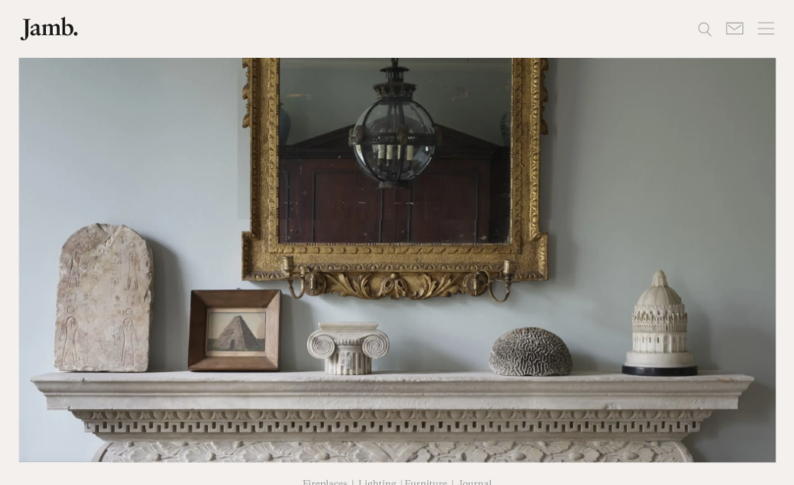

# Jamb Monorepo

<div align="center">
  
  
  <p align="center">
    <strong>An elegant, high-performance monorepo architecture for sophisticated digital experiences.</strong>
  </p>

  <p align="center">
    
    
    
    
    
  </p>
</div>

---

## ✨ Overview

Jamb Monorepo is a sophisticated, production-grade starter kit designed for world-class content experiences. It seamlessly integrates the power of **Next.js 16** with the flexibility of **Sanity Studio v4**, providing an unrivaled platform for both developers and curators.

## 🚀 Key Features

### 📦 Modern Monorepo Architecture

- **Turborepo**: High-performance build system with remote caching and parallel execution.
- **Shared Packages**: Centralized UI components, configurations, and environment logic.
- **Biome/Ultracite**: Ultra-fast linting and formatting for a clean codebase.

### 🌐 Frontend (Next.js 16)

- **App Router & RSC**: Fully utilizes React Server Components for optimal performance.
- **Framer Motion**: Smooth, high-end micro-animations and transitions.
- **Fuzzy Search**: Integrated client-side search using `fuse.js`.
- **Next-Themes**: Native dark/light mode support with system preference detection.

### ✍️ Content Management (Sanity Studio)

- **Headless CMS**: Decoupled content management with a powerful GROQ query engine.
- **Type Safety**: Fully typed schema definitions and auto-generated TypeScript types.
- **Modular Blocks**: PageBuilder pattern for creating dynamic, component-based layouts.
- **Visual Editing**: Real-time live preview and on-page editing with Sanity Visual Editing.

---

## 🧱 Built-in Components

The PageBuilder supports a variety of modular blocks out of the box:

- ⚡ **Hero**: Dynamic hero sections with call-to-action buttons.
- 🍱 **Product Grid**: Responsive grids for showcasing products or items.
- 🌓 **Split Feature**: High-impact feature alternating layouts.
- 🔗 **Category Links**: Visual navigation with custom imagery.

---

## 🏗️ Architecture Highlights

### Type-Safe Environment Variables

Managed via `@workspace/env`, ensuring all Project IDs and API keys are validated with Zod before the application starts.

### Optimized Data Fetching

Uses fragment composition in GROQ queries to ensure over-fetching is minimized and components only receive the data they need.

### Performance-First UI

Built on top of **Radix UI** primitives and **Shadcn UI**, optimized for accessibility and speed.

---

## Project Structure

```text
├── apps/
│   ├── web/          # Next.js 16 Frontend (App Router)
│   └── studio/       # Sanity Studio v4 (CMS)
├── packages/
│   ├── ui/           # Shared React components (Shadcn UI)
│   ├── typescript/   # Shared TypeScript configurations
│   ├── env/          # Type-safe environment variables
│   └── logger/       # Unified logging utility
└── turbo.json        # Turborepo orchestration
```

---

## 🚦 Getting Started

### 1. Prerequisites

- **Node.js**: v22 or higher
- **pnpm**: v10 or higher

### 2. Installation

```bash
pnpm install
```

### 3. Environment Setup

Configure your environment variables in the following files:

**Web (`apps/web/.env`):**

```env
NEXT_PUBLIC_SANITY_PROJECT_ID="your_project_id"
NEXT_PUBLIC_SANITY_DATASET="production"
NEXT_PUBLIC_SANITY_API_VERSION="2025-08-29"
SANITY_API_READ_TOKEN="your_read_token"
```

**Studio (`apps/studio/.env`):**

```env
SANITY_STUDIO_PROJECT_ID="your_project_id"
SANITY_STUDIO_DATASET="production"
```

### 4. Development

Launch both the web application and the studio simultaneously:

```bash
pnpm dev
```

- **Web App**: [http://localhost:3000](http://localhost:3000)
- **Sanity Studio**: [http://localhost:3333](http://localhost:3333)

---

## 📜 Available Scripts

| Command            | Action                                                |
| :----------------- | :---------------------------------------------------- |
| `pnpm dev`         | Start development servers for all apps                |
| `pnpm build`       | Build all packages and apps for production            |
| `pnpm format`      | Fix linting and formatting issues across the monorepo |
| `pnpm lint`        | Check for linting errors                              |
| `pnpm check-types` | Run TypeScript type checking globally                 |

---

## 🚢 Deployment

### Sanity Studio

```bash
cd apps/studio
npx sanity deploy
```

### Next.js Frontend

Recommended for **Vercel**. Connect your repository and set the root directory to `apps/web`. The monorepo structure will be automatically detected.

---

## ⚖️ License

This project is licensed under the **MIT License**.
